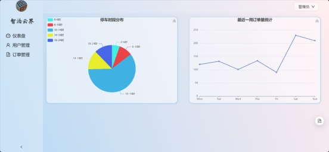
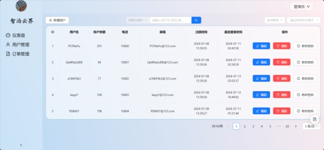
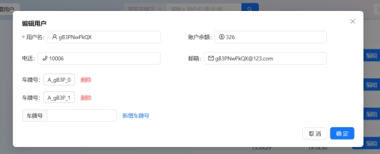
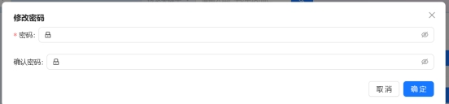
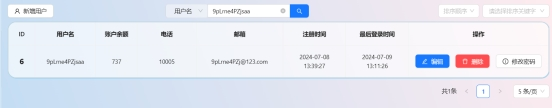
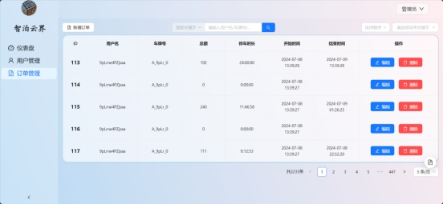
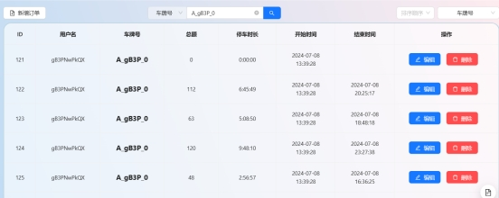
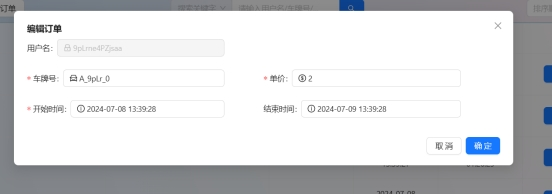

**前端页面开发**

**Web**

**技术栈**

Vue3 + Antd

**页面**

• 登录页面

 

• 首页

• 统计信息展示：通过ECharts展示各种统计图表，如每日订单数量折线图和停车时间分布饼状图。

待完善

 

• 车位状态信息：实时显示车位使用状态，包括空闲、占用、预订等状态。

• 用户列表

可以根据关键字进行降序升序排序

 

• 用户详情查看和编辑

 

• 用户密码修改

 

• 可以根据用户名、电话、邮箱、车牌号进行用户检索

 

• 订单列表

 

• 订单搜索和筛选

 

• 订单详情查看

 

**小程序**

**技术栈**

uniapp开发小程序

**页面**

• 显示当前进行订单，基于平面图展示导航路线

• 用户历史订单管理

• 用户个人信息

￮ 编辑个人信息，账户余额显示和充值，绑定车牌号

￮ 登录功能，绑定手机号，密码登录

 